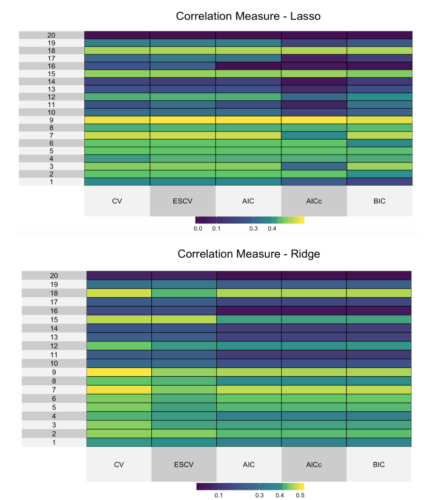
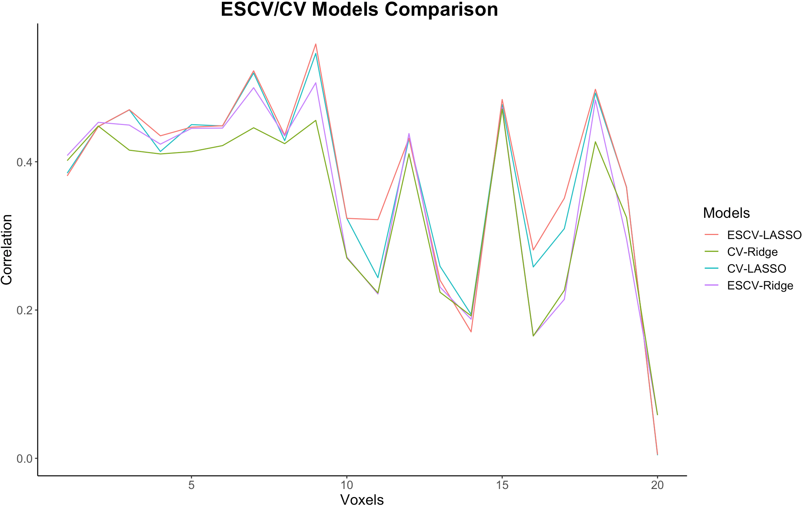
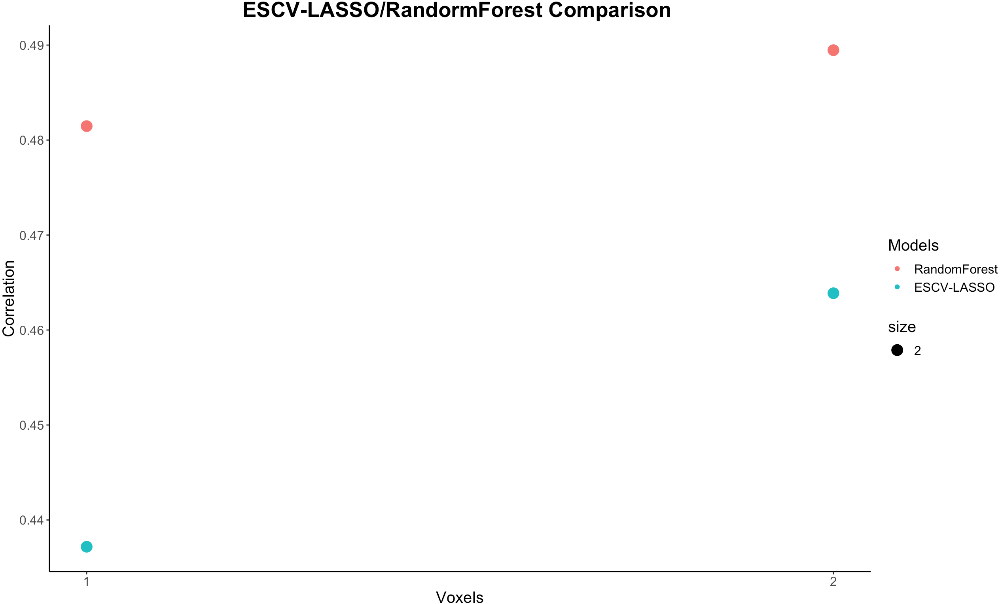
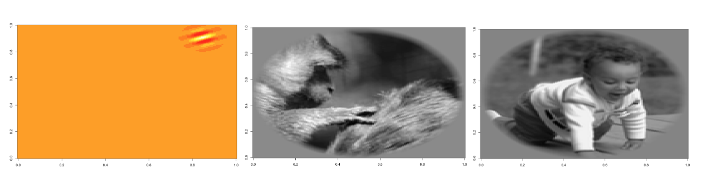
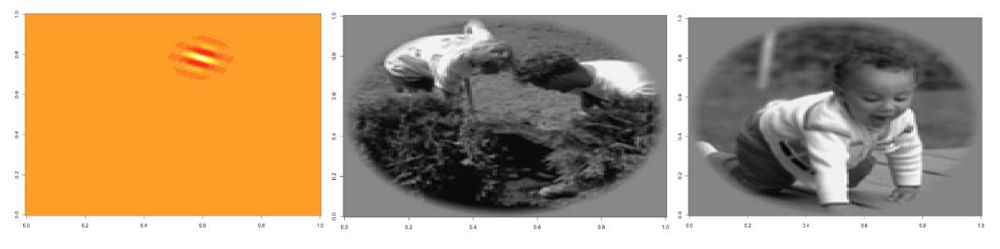
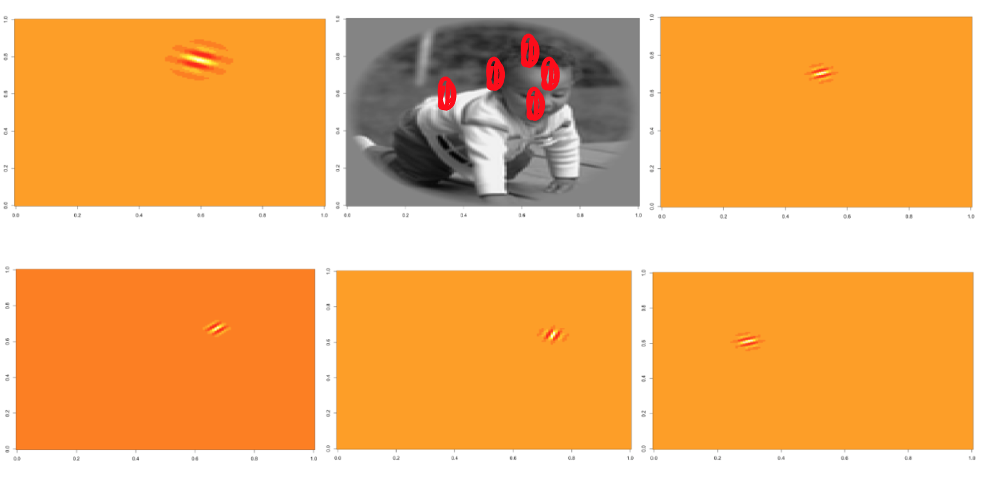

```{r setup, echo = FALSE, message=FALSE, warning=FALSE}
# Load in useful packages
library(reshape2)
library(glmnet)
library(caret)
library(ggplot2)
library(dplyr)
library(ranger)
library(e1071)
library(randomForest)
library(HDCI)
library(foreach)
library(doParallel)
library(parallel)
library(cluster)
library(gridExtra)
library(superheat)
library(kableExtra)
library(knitr)

# Load images and functions
load("data/fMRIdata.RData")
# ls()
source("code/utils.R") 
```

# Introduction
Human brain is comprised of complex strucutres and delicate subunits. People's curiosity towards this charming object builds up the exciting research field, neuroscience. Neuroscience is aiming to decode brain activity, and the invention of fMRI in the 1990s brings neuroscience to an even more exciting stage. fMRI discretizes 3D volumes of the brain into cube-like voxels. Therefore, researchers are able to analyze brain's response to stimuli at a granular level. The previous researches mostly used simple stimuli, but this study is focusing on brain's response to complex visual stimuli: images.


#  Data 
fMRI data is collected by showing each subject 128 x 128 grey scale images, and each image can be represented as a vector of length $128^2$. Through transformation, the length is reduced to 10921, representing the features of each image. resp\_dat (1750 x 20) contains responses from 20 voxels to 1750 images. fit\_dat(1750 x 10921) contains the features of 1750 transformed images. val\_feat contains a validation set of 120 transformaed images. loc\_dat contains 3D spatial location of the voxels. 


## Exploratory Data Analysis
The given data is very clean, no need for extra data cleaning. Both feature matrix and response vectors contain continuous variables with some columns containing constant numerical values. 


# Model Selection 

In order to investigate how voxels respond to images, we first experiment with various prediction models and select the best performed ones to proceed to the future analysis. Before model construction, the original data is split into training, validation and test sets with 60:20:20 ratio. LASSO and Ridge are used as the two regression models for comparison. Penalty parameter for each model is selected with different criteria: CV, ESCV, AIC, AICc and BIC. The performance indicator is the same as the one used in the Gallant lab. Performance of each model is evaluted by finding the correlation between the fitted values and observed values on a validation set for each voxel. The higher the correlation measure, the better the performance of the model. 


Each selection criteria has its pros and cons. AIC tends to be a more conservative selection criteria since it prefers a model with more parameters. In contrast, BIC penalizes additional parameters more seriously by introducing the penality term $m*ln(n)$.m represents the number of parameters and n represents the number of observations. BIC is better applied on nested models compared to AIC. BIC is well known for selecting the true model, meaning that if the true model is within the candidates, BIC will select the true model with probability 1 as n$\rightarrow \infty$. However, when n is finite, AIC tends to select a better model than BIC since AIC is good for finidng the best approximating model. AICc is known as the small sample corrected AIC. Therefore, when n is large, the performance of AIC and AICc will converge. When n is finite, AICc tends to perform better than AIC.


CV is intuitively more straightforward and is actually asymptotically equivalent to AIC criteira. It is sensitive to both the functional form and the number of parameters. However, since CV averages over multiple partitions, the partition proportion also plays a role in CV performance. Partition may potentially cause "loss of data", leading to instability in CV. When CV is applied onto a sparse model, like LASSO,it tends to become unstable in high dimensions. ESCV would be a better substitute to handle this situation. ESCV is built on CV, but it cuts down the false positive rate and finds a smaller model locally with high stability. However, cutting down the false positive rate at the same time will sacrifice true positive rate.


To investigate how each model performs in practice, in Figure \ref{fig:cor-plot}, we plot the correlation of LASSO and Ridge models in combination with the five model selection criteria. Apprently, CV and ESCV combined with both LASSO and Ridge outperform the models with selection criteria AIC,AICc and BIC.The reason might be that CV and ESCV are non-parametric parameter selection methods, which would be more flexible to react to large and noisy feature sets. BIC performs the worst in this case because when the "true" model is not within the candidates, its non-conservative selection algorithm would put constraint on its performance. 


However, the performance of ESCV and CV is hard to distinguish from the plots. Therefore, we zoom in ESCV-LASSO, CV-LASSO, ESCV-Ridge, and CV-Ridge to select the best performed model. 


In Figure \ref{fig:line-plot},ESCV-LASSO, which is coded in red, has an overall better performance than the other three models. However, the performance is not drastically better than CV-LASSO. ESCV-Ridge has the third best performance and followed by CV-Ridge. By comparing the four models, ESCV seems to be a better selection criteria than CV, and LASSO has an overall better performance than Ridge. Therefore, ESCV-LASSO is selected as the best performed model for future analysis. This result verifies the previous statement that ESCV handles sparse model better than CV. 


```{r split_data, echo=FALSE, eval = FALSE,warning=FALSE, message=FALSE,cache = TRUE}

## NOTE: set eval = TRUE to run this part 

# combine features and responses 
dat <- cbind(fit_feat,resp_dat)
dat <- data.frame(dat)

# train: test: val (0.6 :0.2 :0.2)
split.dat <- SplitTV(dat,0.6)

# get training set 
train.set <- split.dat[[1]]
# label features and voxels 
names(train.set) <- c(paste0("V", 1:ncol(fit_feat)),paste0("Voxel", 1:ncol(resp_dat)) )

# get test set 
test.set <- split.dat[[2]]
# label features and voxels 
names(test.set) <- c(paste0("V", 1:ncol(fit_feat)),paste0("Voxel", 1:ncol(resp_dat)) )

# get val set 
val.set <- split.dat[[3]]
# label features and voxels 
names(val.set) <- c(paste0("V", 1:ncol(fit_feat)),paste0("Voxel", 1:ncol(resp_dat)) )

```


```{r model_select, echo=FALSE, eval = FALSE,warning=FALSE, message=FALSE,cache = TRUE}

## Model selection 

# running this will generate correlation & lambda matrix for all five models
# This chunk takes a while to run, "eval" is set to FALSE
# Change eval = TRUE to run this chunk 
# to check final output: uncomment the following 
# load("extra/correlation.RData")
# load("extra/lamnda.RData")

## Run on all 20 voxels 
N <- 20
# collect correlation measures 
cor_vec <- c()
# collect lambdas
lam_vec <- c()

for (i in 1: N){
  # feature columns 
  n <- ncol(fit_feat) 
  # Voxel column at this iteration 
  idx <- n + i
  # get Voxel name
  Vox <- paste0("Voxel",i)
  
  # NOTE: 
  # "Transform" will structure dataframes into appropeiate form to run glmnet
  # see utils.R - Transform() for more details 
  
  # get training set 
  X.train <- Transform(train.set[,1:n],Vox)
  # get ith voxel 
  Y.train <- Transform(data.frame(train.set[,idx]),Vox)
  # get val features 
  X.val <- Transform(val.set[,1:n],Vox)
  # get ith voxel 
  Y.val <- Transform(data.frame(val.set[,idx]),Vox)
  
  result_cv <- ModSelect(X.train,Y.train,X.val,Y.val,"lasso","CV")
  result_escv <- ModSelect(X.train,Y.train,X.val,Y.val,"lasso","ESCV")
  result_aic <- ModSelect(X.train,Y.train,X.val,Y.val,"lasso","AIC")
  result_aicc <- ModSelect(X.train,Y.train,X.val,Y.val,"lasso","AICc")
  result_bic <- ModSelect(X.train,Y.train,X.val,Y.val,"lasso","BIC")
  
  # return correlation & lambda
  # [[1]] corresponds to correlation 
  # [[2]] corresponds to lambda 
  # see utils.R - ModSelect() for more details 
  cor_vec <- rbind(cor_vec,
                   c(result_cv[[1]],result_escv[[1]],
                     result_aic[[1]],result_aicc[[1]],result_bic[[1]]))
  
  lam_vec <- rbind(lam_vec,
                   c(result_cv[[2]],result_escv[[2]],
                     result_aic[[2]],result_aicc[[2]],result_bic[[2]]))
}
colnames(cor_vec) <- c("CV","ESCV","AIC","AICc","BIC")
colnames(lam_vec) <- c("CV","ESCV","AIC","AICc","BIC")

```


```{r superheat,out.width='.60\\linewidth', fig.show='hold', fig.height = 5, fig.width = 5, fig.align='center',echo = FALSE, eval = FALSE, message=FALSE, warning=FALSE, fig.pos="H"}

# Make correlation heatmap 
heat.lasso <- superheat(abs(cor_vec),
                        title = "Correlation Measure - Lasso",
                        title.size = 8)

heat.ridge <- superheat(abs(r_cor_vec),
                        title = "Correlation Measure - Ridge",
                        title.size = 8)
```


```{r cor-plot,out.width='.60\\linewidth', fig.show='hold', fig.height = 5, fig.width = 5, fig.align='center', fig.cap = "Correlation measures of five models for lasso and five models for ridge. Each model corresponds to a different selection criteria (CV,ESCV,AIC, AICC, BIC).", echo = FALSE, message=FALSE, warning=FALSE, fig.pos="H"}

# correlation heatmap


```


```{r compare,out.width='.60\\linewidth', fig.show='hold', fig.height = 5, fig.width = 5, fig.align='center', echo = FALSE, eval = FALSE,message=FALSE, warning=FALSE, fig.pos="H"}

# Model performance line plot 
best.cor <- data.frame(cbind(cor_vec[,1:2],r_cor_vec[,1:2]))
line.plot <- ggplot(best.cor, aes(x=c(1:20)))

line.plot <- line.plot + 
  geom_line(aes(y = best.cor[,1],colour = "red")) +
  geom_line(aes(y = best.cor[,2],colour = "blue")) +
  geom_line(aes(y = best.cor[,3],colour = "yellow")) +
  geom_line(aes(y = best.cor[,4],colour = "green")) +
  ggtitle("ESCV/CV Models Comparison ")+
  xlab("Voxels") +
  ylab("Correlation") +
  scale_color_discrete(name = "Models", 
                       labels = c("ESCV-LASSO", "CV-Ridge",
                                  "CV-LASSO","ESCV-Ridge"))+
   theme_bw() +
   theme(panel.border = element_blank(),
                     panel.grid.major = element_blank(),
                       panel.grid.minor = element_blank(), 
                     axis.line = element_line(colour = "black"),
         plot.title = element_text(size = 20, face = "bold",hjust = 0.5),
         text = element_text(size = 15))

```


```{r line-plot,out.width='.75\\linewidth', fig.show='hold', fig.height = 8, fig.width = 5, fig.align='center', fig.cap = "Performance comparison of ESCV-LASSO,CV-LASSO,ESCV-Ridge,and CV-Ridge.", echo = FALSE, message=FALSE, warning=FALSE, fig.pos="H"}

# line plot 


```

# Diagnostics:
ESCV-LASSO and CV-LASSO have been shown to have the best performance during the model selection stage. However, the stability and prediction accuray need to be further investigated. First, we run the two models on voxel 1 and voxel 2 to compare the correlation measures with the previous results. This will give us a sense of prediction stability. Also, we would like to verify whether ESCV always outperform CV to assess the model stability. To do this, we run the selected models on the test set. 

In Table 1, we summarized the correlation measures of ESCV-LASSO and CV-LASSO for voxel 1 and 2 on validation set, together with the results run on test set. Both models have even higher prediction accuracy running on the test set. Therefore, the fit of the models seem to be constantly good on new data set. However, for voxel 2, CV has a slightly higher correlation measure than ESCV when running on the test set. This indicates that the relative performance of CV-LASSO and ESCV-LASSO may vary in response to new data set. Overall, ESCV-LASSO achieves higher correlation but there could be cases that CV-LASSO actually outperforms ESCV-LASSO. 


## Outliers
Running on 20 voxels, we do detect some outliers. For example, voxel 16 and voxel 20 have extremely low correlation across all models. Voxel 20 even have correlation measures close to 0 even running with ESCV-LASSO. The reason might be that voxel 20 does not have a fixed or regular response pattern to visual stimuli. The collected features are not good predictors to capture the response of voxel 20 to images. Therefore, with the restriction of collected data, even a stable and well-performed model, like ESCV-LASSO, fails to make an accurate prediction.  


```{r diagnostics,out.width='.60\\linewidth', fig.show='hold', fig.height = 5, fig.width = 5, fig.align='center', echo = FALSE, eval = FALSE,message=FALSE, warning=FALSE, fig.pos="H"}

# running on test set with voxel 1 and 2 
# model: CV-LASSO, ESCV-LASSO
# eval is set to FALSE
# uncomment the following to check the diagnostics data
# load("extra/diagnostics.RData")

cor.1.2 <- cor_vec[1:2,1:2]
lambda.1.2 <- lam_vec[1:2,1:2]
test.cor <- matrix(NA,nrow = 2, ncol= 2)
V <- 2
for(i in 1: V){

# feature columns 
  n <- ncol(fit_feat) 
# Voxel column
  idx <- n + i
# Voxel name
  Vox <- paste0("Voxel",i)

  X.train <- Transform(train.set[,1:n],Vox)
  Y.train <- Transform(data.frame(train.set[,idx]),Vox)
  X.test <- Transform(test.set[,1:n],Vox)
  Y.test <- Transform(data.frame(test.set[,idx]),Vox)

  test_cv_fit <- glmnet(X.train,Y.train,lambda = lambda.1.2[i,1] )
  test_cv_pred <- predict.glmnet(test_cv_fit,newx = X.test)
  test_cv_cor <- cor(test_cv_pred,Y.test)

  test_escv_fit <- glmnet(X.train,Y.train,lambda = lambda.1.2[i,2] )
  test_escv_pred <- predict.glmnet(test_escv_fit,newx = X.test)
  test_escv_cor <- cor(test_escv_pred,Y.test)
  
  test.cor[i,] <- c(test_cv_cor, test_escv_cor)
}

diag.table <- cbind(cor.1.2,test.cor)
names(diag.table) <- c("CV","ESCV","test.CV","test.ESCV")
row.names(diag.table) <- c("Voxel1", "Voxel2")
diag.table <- diag.table %>% select(CV,test.CV,ESCV,test.ESCV)

#save(diag.table,file = "diagnostics.RData")
```

```{r test-table,out.width='\\linewidth', fig.show='hold', fig.align='center', echo = FALSE,message=FALSE, warning=FALSE, fig.pos="H"}

# load diagnostics table
load("extra/diagnostics.RData")
diag.table %>% kable(caption = "Model Diagnostics: Voxel 1 and 2")

```


## Further Improvement of the Model 
After running with ESCV-LASSO and CV-LASSO, we get both prediction results and also selected features by LASSO. One thought is, if we use only the selected features from ESCV-LASSO to run other models, can we achieve better performance? To test the idea, we use the selected features from ESCV-LASSO and run random forest only with selected features. 

In Figure \ref{fig:line-plot}, we compare the performance of using ESCV-LASSO and using selected features from ESCV-LASSO to run random forest on voxel 1 and voxel 2. It turns out that the performance is consistently better on both voxels when running the model with random forest with only the selected features from ESCV-LASSO. The reason could be that we use ESCV-LASSO to largely reduce the noise within the dataset. Random forest itself has great prediction performance and avoids overfitting. Combining these two models thus improves the correlation measure. 


```{r rf-and-escv,out.width='.60\\linewidth', fig.show='hold', fig.height = 5, fig.width = 5, fig.align='center', echo = FALSE, eval = FALSE,message=FALSE, warning=FALSE, fig.pos="H"}

# take very long to run, so eval set to FALSE
# to check rf performance data, uncomment this:
# load("extra/rf_compare.RData")

# Call random forest to run on only selected features from escv
v1_rf <- RF(train.set, test.set,1)
v2_rf <- RF(train.set, test.set,2)

# collect voxel 1 and 2 correlation
rf_cor <- c(v1_rf,v2_rf)
rf.df <- diag.table %>% select(test.ESCV)
rf.df <- cbind(rf.df,rf_cor)
#save(rf.df,file = "rf_compare.RData")
```


```{r rf-plot,out.width='0.8\\linewidth', fig.show='hold', fig.height = 10, fig.width = 5, fig.align='center', fig.cap = "Compare correlation with only ESCV-LASSO vs. further processing with RandomForest", echo = FALSE, message=FALSE, warning=FALSE, fig.pos="H"}

# random forest performance 


```

# Feature Analysis 

After thoroughly comparing and choosing the best model for predicting the voxel response to images, we now shift our focus to interpret the results. For the following sections, we will map our findings back to the images to see what the numerical values mean in reality. ESCV-LASSO and CV-LASSO are the models we choose to generate the following results. 

## Features Shared Across Voxels 

First, we are curious to know if there are any features shared by 20 voxels.In fact, 32 features are shared across all 20 voxels using ESCV-LASSO model. For example, feature 915,994,1012,1152,1260,1405,4099,4119, etc. There is an interesting pattern shared by some features such as feature 915 and feature 994. They always locate at the dark empty part of the image but never onto the identifiable part(e.g.human face,eyes). In Figure \ref{fig:feature-915}, we map feature 915 onto two randomly selected images: 1 and 903, one with human and another one with animal. The assumption is that all voxels share feature 915, 994 beacause those features are used to identify the background information, which is a necessary functionality for each voxel, and they may very likely respond to the background information in the same manner. 


```{r feature-voxel,out.width='.60\\linewidth', fig.show='hold', fig.height = 5, fig.width = 5, fig.align='center', echo = FALSE, eval = FALSE,message=FALSE, warning=FALSE, fig.pos="H"}

## NOTE: 

#load("extra/feature.RData")
# after loading, will get "feat", which is a feature list 20 components 
#  each component contains predictors for each voxel 

N <- 20
feat <- list()
for (i in 1: N){
  # feature columns 
  n <- ncol(fit_feat) 
  # Voxel column
  idx <- n + i
  # Voxel name
  Vox <- paste0("Voxel",i)
  # get training features 
  X.train <- Transform(train.set[,1:n],Vox)
  # get ith voxel 
  Y.train <- Transform(data.frame(train.set[,idx]),Vox)
  nnzeros <- Feature(X.train,Y.train)
  feat[[i]] <- nnzeros
}

# get shared features across voxels
shared.feat <- Reduce(intersect, feat)

```


```{r image,out.width='.60\\linewidth', fig.show='hold', fig.height = 5, fig.width = 5, fig.align='center', echo = FALSE, eval = FALSE,message=FALSE, warning=FALSE, fig.pos="H"}

# play and check feature-image mapping using the following code

# Read in a raw image.
img1 <- ReadImage(1)
image(img1, col = gray((1:500) / 501))

# Load in a raw basis function (function may not work for windows users).
wav1 <- ReadRealBasisFunction(915)
image(wav1)

```


```{r feature-915,out.width='\\linewidth', fig.show='hold', fig.height = 10, fig.width = 5, fig.align='center', fig.cap = "Map feature 915,which is shared by all voxels, onto image 1 and image 903. It identifies the background of each image.", echo = FALSE, message=FALSE, warning=FALSE, fig.pos="H"}

# features shared across voxels


```


## Features Shared Across Models 

Now, we would like to see if there are any features shared across models. We understand that instability exists within our models, so if the features could combat model instability, then they must encode important information. We zoom in voxel 1 to explore interesting patterns. Using ESCV-LASSO and CV-LASSO to select predictors for voxel1, only feature 1145 is shared across models. In Fig \ref{fig:feature-1145}, we map this feature onto images. Most of the time, this feature locates at the head part. More specifically, it identifies hair. The identification is not only restricted to human head. When mappin onto image with animals, such as image 903, it also identifies the monkey's hair. Feature 1145 is a realtively stable singal across models. Therefore, it does unfold part of the mystery of voxel 1. One assumption is: voxel 1 is sensitive to the visual stimuli "hair." 

```{r feat-model,out.width='.60\\linewidth', fig.show='hold', fig.height = 5, fig.width = 5, fig.align='center', echo = FALSE, eval = FALSE,message=FALSE, warning=FALSE, fig.pos="H"}

escv_feat <- feat[[1]]
X.train <- Transform(train.set[,1:n],"Voxel1")
Y.train <- Transform(data.frame(train.set[,idx]),"Voxel1")
cv_feat <- Feature(X.train,Y.train,"CV")
shared.v1 <- intersect(escv_feat,cv_feat)
#[1] 1145
```


```{r feature-1145,out.width='\\linewidth', fig.show='hold', fig.height = 10, fig.width = 5, fig.align='center', fig.cap = "Map feature 1145,which is a predictor of voxel 1,shared across models,onto image 3 and image 3. It identifies human head, especially the hair part.", echo = FALSE, message=FALSE, warning=FALSE, fig.pos="H"}

# feature shared across models


```


## Features Shared Across Bootstrap Samples

To further investigate model's internal stability of selecting features and further investigate how voxel 1 responds to images, we apply bootstrap for 20 iterations and use ESCV-LASSO as the prediction model on voxel 1. There are no features shared by all 20 bootstrap samples for the following reasons: 1) the model is not stable enough in terms of feature selection 2) the total amount of features in the original data is huge, leading to unavoidable noise 3) the total number of bootstrap samples is small due to computation time limitation. 


Therefore, instead of searching for the stable features across all bootstrap samples, we decide to count the occurence of each selected feature to detect the relative stability of features across bootstrap samples. 

In Table 2, we summarized the features with occurence larger than 5 times out of 20 bootstrap samples. Feature 1145 is selected 9 out of 20 times, which once again verifies the significance of feature 1145 as a predictor for voxel 1. Other features that have high occurence are 5163,5460,5733,5875. 

In Fig \ref{fig:feature-all5}, we map these five features onto one single image to see as a group of features, how they could possibly unfold a hidden story. These five features all surround the human head in this image. They work together to identify the contour of human head. It is reasonable to conclude that the features remaining stable across bootstrap samples are the ones important for voxel 1 to capture the core imformation from an image, for example, human head. However, this part of analysis is quite limited. Extending to large number of bootstrap samples and to other 19 voxels would definitely reveal more exciting patterns. 


```{r boot-table,out.width='\\linewidth', fig.show='hold', fig.align='center', echo = FALSE,message=FALSE, warning=FALSE, fig.pos="H"}

load("extra/boot.RData")

b.feat <- c()
for (i in 1: 20){
b.feat <- c(b.feat,unlist(result[[i]][1]))
}

count <- as.data.frame(table(b.feat))
names(count) <- c("feature","count")

count %>% filter(count >= 5) %>% 
  kable(caption = "Features shared across bootstrap samples with high frequency")

```

```{r feature-all5,out.width='\\linewidth', fig.show='hold', fig.height = 10, fig.width = 5, fig.align='center', fig.cap = "Map relatively stable features across bootstrap samples onto image 1.  From left to right, top to bottom: feature 1145,5163,5460,5733,5875.These features circle around human head.", echo = FALSE, message=FALSE, warning=FALSE, fig.pos="H"}



```

## Hypothesis Testing 

In the previous analysis, we were able to extract features and the corresponding beta values from the model we chose. A natural follow-up question would be: are those features/betas statistically significant? To answer this question, we could conduct hypothesis testing. 


Hypothesis testing can be conducted at the following steps: 

1. Pick predictors that are stable across bootstrap samples and extract their corresponding $\beta$ values. Calculate the statistics of each individual beta such as mean and standard error. 

2. The null hypothesis is that the observed beta is not statistically significant. We calculate t-statistics to evaluate the significance of each individual beta using the following formula. The subscript B represents the bootstrap samples which betas are extrtacted from.

$$t = \frac{\hat{\beta}_B-\beta_B}{SD(\hat{\beta}_B)}$$

3. If $|t| < 1.95$, then we say the true beta belongs to a 95\% confidence interval. Otherwise, we reject the null hypothesis.

4. Now we are only looking at 20 bootstrap samples and only one beta is relatively stable across all the samples. However, if we extend to large number of bootstrap samples, n = 100000, there might be multiple betas that remain stable and need to conduct hypothesis testing on. In that case, we would face a multiple hypothesis testing problem and we need to adjust the significance threshhold. There are multiple ways to approach this. For example, we could do Bonferroni Correction: $\alpha / n$ to account for multiple betas we would like to test on. Alternatively, we could use False Discovery Rate, which is the proportion of false positives among all significant results. 


```{r final-pred,out.width='.60\\linewidth', fig.show='hold', fig.height = 5, fig.width = 5, fig.align='center', echo = FALSE, eval = FALSE,message=FALSE, warning=FALSE, fig.pos="H"}
# get training features 
X.train.1 <- Transform(train.set[,1:n],"Voxel1")
# get ith voxel 
Y.train.1 <- Transform(data.frame(train.set[,idx]),"Voxel1")
final_escv <- escv.glmnet(X.train,Y.train)
final_fit <- glmnet(X.train,Y.train,lambda = final_escv$lambda.escv )
final_pred <- predict.glmnet(final_fit,newx = val_feat)
out <- as.vector(final_pred)
write.table(out,sep="\n",file = "predv1_LinqingWei.txt",
            col.names = F, row.names = F)
```

# Conclusion

Decoding fMRI data to unfold humna brainactivity related to image identification is an exciting direction to dive into. The decoding process requires the construction of well-performed prediction models. ESCV-LASSO is a great model of handling feature selection, prediction, and model stability. A well structured statistical model provides trustworthy and meaningful clues to help us decode voxel response patterns to images. It is interesting to find out that features that are shared across models and withstand the stability test are associated with important identification information of each image. However, these findings only reveal a small portion of the voxel mystery. 

The future direction would be to extend the stability test and also apply the analysis onto all voxels. At the same time, we would like to explore prediction models with even higher accuracy to capture the intricate pattern we might have missed in this study. 


```{r final-pred-rf,out.width='.60\\linewidth', fig.show='hold', fig.height = 5, fig.width = 5, fig.align='center', echo = FALSE, eval = FALSE,message=FALSE, warning=FALSE, fig.pos="H"}

## Final prediction with ESCV+RF

# feature columns 
n <- ncol(fit_feat) 
# Voxel 1
idx <- n + 1

Y.train.final <- Transform(data.frame(train.set[,idx]),"Voxel1")
X.train.final <- Transform(train.set[,1:n],"Voxel1")

selected <- Feature(X.train.final,Y.train.final,Criteria = "ESCV")

X.train.new <- X.train.final[,selected]
# test set is now val_feat
colnames(val_feat) <-  c(paste0("V", 1:ncol(fit_feat)))
X.test.new <- val_feat[,selected]


train.rf.final <- cbind(X.train.new,Y.train.final)

# use escv selected features to run random forest
rf_fit.final <- train(Voxel1 ~ ., 
                data = train.rf.final, 
                method = "ranger")

## final
save(rf_fit.final,file = "rf_fit_final.RData")

# make prediction on val_feat
rf_pred.final <- predict(rf_fit.final, X.test.new)
out.rf<- as.vector(rf_pred.final)

write.table(out.rf,sep="\n",file = "predv1_LinqingWei.txt",
            col.names = F, row.names = F)

```


# Bibliography

[1] Kay, K., Naselaris, T., Prenger, R. and Gallant, J. (2008). "Identifying natural images from human brain activity." Nature 452(20):352-355.

[2] Lim, C. and Yu, B. (2013). "Estimation Stability with Cross Validation." Jounral of Computational and Graphical Statistics 25(2):1-31.
