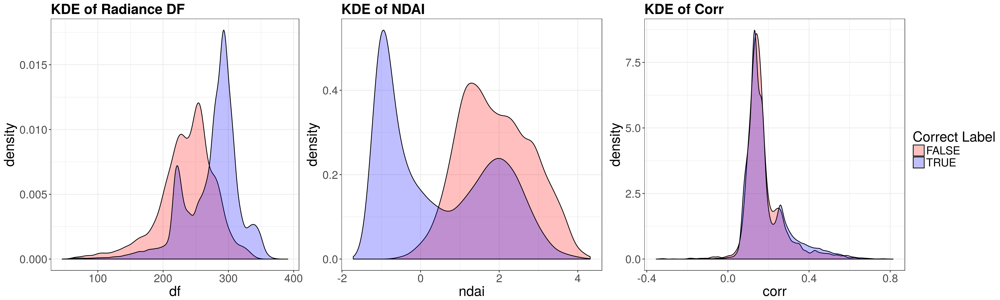
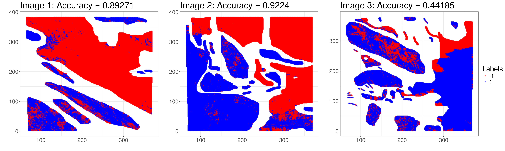

```{r setup, echo = FALSE, message=FALSE, warning=FALSE}
# Load in useful packages
library(caret)
library(tidyverse)
library(knitr)
library(stringr)
library(ggplot2)
library(ggpubr)
library(lubridate)
library(dplyr)
library(reshape2)
library(plotly)
library(png)
library(gridExtra)
library(grid)
# color scale
library(viridis)
# grid arrange
library(gridExtra)

# Functions
library(aod)
library(e1071)
library(randomForest)

# separability
library(kernlab)
library(VGAM)

# multicolinearity 
library(caret)
library(corrplot)

# Load images and functions
source("R/load_data.R")
source("R/utils.R") 
```

# Introduction
As the Earth's climate changes, interest in atmospheric carbon dioxide continues to grow. Research has shown that the strongest dependency of climate change on atmospheric carbon dioxide will take place in the Arctic. In order to study this dependence more in-depth, accurate measurements of cloud coverage in the Arctic are needed, as clouds help modulate sensitivity to increasing surface air temperatures in the Arctic. However, because of the prominence of ice- and snow-covered surfaces, it is difficult for existing technologies to detect clouds. This poses a challenge, as identifying clouds over the Arctic is necessary for assessing their impact, whether positive or negative, on electromagnetic radiation flow through the atmosphere. 


# Satellite Data

## Data Collection and Cleaning
In order to address this challenge, Shi et al. [1] collected and analyzed atmospheric data from the Multiangle Imaging SpectroRadiometer (MISR) on the NASA Terra satellite, which made available electromagnetic radiation measurements at nine view angles in four spectral bands. The nine angles include 70.5 (DF), 60.0 (CF), 45.6 (BF), 26.1 (AF), and 0.0 (AN) degrees. In addition to the radiation measurements at these five angles, data used in this study consisted of three features chosen after extensive exploratory data analysis by the authors. These three features are the correlation (CORR) of MISR images of the same scene from different viewing angles, the standard deviation (SD) of the nadir camera pixel values across a scene, and a normalized difference angular index (NDAI) that characterizes the changes in a scene with changes in the view direction. 

Of the 233 geographically distinct MISR paths, this study utilized data collected from 10 orbits over the Arctic, northern Greenland, and Baffin Bay. The 10 orbits span about 144 days during daylight season in the Arctic in 2002. Each orbit had 6 data units, though 3 of the 60 were dropped, leaving 57 total for this study. The resulting data consists of over 7 million pixels, where each pixel covers a 1.1km $\times$ 1.1km region on the ground and has 36 radiation measurements. In order to evaluate performance of the classification methods used in the study, one of the authors hand-labeled clear versus cloudy pixels. This was only done for the pixels they were highly confident of labeling, as this was the best known method for obtaining validation data. Only about 71.5% of the total number of valid pixels were labeled, and these labels will be used here to validate our classification models built for images of three data units. 

## Exploratory Data Analysis

Exploratory data analysis was conducted through data visualization and numerical summaries. First we look at the true cloud labels for each of the three images, and then we visualize the features available for use in building classification models.

```{r labels_plots, echo=FALSE, warning=FALSE, message=FALSE, fig.height = 2, fig.align='center', fig.cap = "Plot of expert labels for each image from the raw satellite data.", fig.pos="H", cache = TRUE}
# Plot expert labels for each image
labels_plt1 <- ggplot(image.file1) + geom_point(aes(x = x.coord, y = y.coord,
                                                    colour = exp.label)) + 
  ggtitle('Image 1') +
  theme_bw() +
  theme(plot.title = element_text(size = 8, face = "bold"),
        text = element_text(size = 8),
        axis.title.x = element_blank(),
        axis.title.y = element_blank()) +
  scale_fill_manual(values = c('red', 'green', 'blue'))
labels_plt2 <- ggplot(image.file2) + geom_point(aes(x = x.coord, y = y.coord,
                                                    colour = exp.label)) +
  ggtitle('Image 2') +
  theme_bw() +
  theme(plot.title = element_text(size = 8, face = "bold"),
        text = element_text(size = 8),
        axis.title.x = element_blank(),
        axis.title.y = element_blank()) +
  scale_fill_manual(values = c('red', 'green', 'blue'))
labels_plt3 <- ggplot(image.file3) + geom_point(aes(x = x.coord, y = y.coord,
                                                    colour = exp.label)) +
  ggtitle('Image 3') +
  theme_bw() +
  theme(plot.title = element_text(size = 8, face = "bold"),
        text = element_text(size = 8),
        axis.title.x = element_blank(),
        axis.title.y = element_blank()) +
  scale_fill_manual(values = c('red', 'green', 'blue'))


ggarrange(labels_plt1, labels_plt2, labels_plt3, ncol=3, nrow=1, 
          common.legend = TRUE, legend = 'right')
```

In Figure \ref{fig:labels_plots}, expert labels are shown for each image. Red indicates a negative label, where there are no clouds. Blue indicates a positive label, where clouds are present. Green indicates an area where experts were unable to determine the presence of clouds, leaving these points unlabeled. 

```{r kde_plots, echo=FALSE, warning=FALSE, message=FALSE, fig.align='center', fig.cap = "KDE plots of each feature in image 1, with mean as a dotted line. Other images followed similar trends, so we only display image 1.", echo = FALSE, message=FALSE, warning=FALSE, fig.pos="H", cache = TRUE}
# calculate means for each feature for plotting on the KDE plots
data1_means <- image.file1 %>%
  group_by(exp.label) %>%
  summarise(df = mean(df),
            cf = mean(cf),
            bf = mean(bf),
            af = mean(af),
            an = mean(an),
            ndai = mean(ndai),
            corr = mean(corr),
            sd = mean(sd))

# Kernel density plots for each image + each radiance
df_plot <- ggplot(image.file1, aes(x = df, fill = exp.label)) + 
  geom_density(alpha = 0.25) + ggtitle('Image 1: Radiance DF') +
  theme_bw() +
  theme(plot.title = element_text(size = 8, face = "bold"),
        text = element_text(size = 8)) +
  scale_fill_manual(values = c('red', 'green', 'blue')) +
  geom_vline(data = data1_means, aes(xintercept = df, colour = exp.label), 
             linetype = "dashed")

cf_plot <- ggplot(image.file1, aes(x = cf, fill = exp.label)) + 
  geom_density(alpha = 0.25) + ggtitle('Image 1: Radiance CF') +
  theme_bw() +
  theme(plot.title = element_text(size = 8, face = "bold"),
        text = element_text(size = 8)) +
  scale_fill_manual(values = c('red', 'green', 'blue')) +
  geom_vline(data = data1_means, aes(xintercept = cf, colour = exp.label), 
             linetype = "dashed")

bf_plot <- ggplot(image.file1, aes(x = bf, fill = exp.label)) + 
  geom_density(alpha = 0.25) + ggtitle('Image 1: Radiance BF') +
  theme_bw() +
  theme(plot.title = element_text(size = 8, face = "bold"),
        text = element_text(size = 8)) +
  scale_fill_manual(values = c('red', 'green', 'blue')) +
  geom_vline(data = data1_means, aes(xintercept = bf, colour = exp.label), 
             linetype = "dashed")

af_plot <- ggplot(image.file1, aes(x = af, fill = exp.label)) + 
  geom_density(alpha = 0.25) + ggtitle('Image 1: Radiance AF') +
  theme_bw() +
  theme(plot.title = element_text(size = 8, face = "bold"),
        text = element_text(size = 8)) +
  scale_fill_manual(values = c('red', 'green', 'blue')) +
  geom_vline(data = data1_means, aes(xintercept = af, colour = exp.label), 
             linetype = "dashed")

an_plot <- ggplot(image.file1, aes(x = an, fill = exp.label)) + 
  geom_density(alpha = 0.25) + ggtitle('Image 1: Radiance AN') +
  theme_bw() +
  theme(plot.title = element_text(size = 8, face = "bold"),
        text = element_text(size = 8)) +
  scale_fill_manual(values = c('red', 'green', 'blue')) +
  geom_vline(data = data1_means, aes(xintercept = an, colour = exp.label), 
             linetype = "dashed")

corr_plot <- ggplot(image.file1, aes(x = corr, fill = exp.label)) + 
  geom_density(alpha = 0.25) + ggtitle('Image 1: Corr') +
  theme_bw() +
  theme(plot.title = element_text(size = 8, face = "bold"),
        text = element_text(size = 8)) +
  scale_fill_manual(values = c('red', 'green', 'blue')) +
  geom_vline(data = data1_means, aes(xintercept = corr, colour = exp.label), 
             linetype = "dashed")

ndai_plot <- ggplot(image.file1, aes(x = ndai, fill = exp.label)) + 
  geom_density(alpha = 0.25) + ggtitle('Image 1: NDAI') +
  theme_bw() +
  theme(plot.title = element_text(size = 8, face = "bold"),
        text = element_text(size = 8)) +
  scale_fill_manual(values = c('red', 'green', 'blue')) +
  geom_vline(data = data1_means, aes(xintercept = ndai, colour = exp.label), 
             linetype = "dashed")

sd_plot <- ggplot(image.file1, aes(x = sd, fill = exp.label)) + 
  geom_density(alpha = 0.25) + ggtitle('Image 1: SD') +
  theme_bw() +
  theme(plot.title = element_text(size = 8, face = "bold"),
        text = element_text(size = 8)) +
  scale_fill_manual(values = c('red', 'green', 'blue')) +
  geom_vline(data = data1_means, aes(xintercept = sd, colour = exp.label), 
             linetype = "dashed")

ggarrange(df_plot, cf_plot, bf_plot, af_plot, an_plot, corr_plot, ndai_plot, 
          sd_plot, nrow = 3, ncol = 3, common.legend = TRUE, legend = 'right')

```

In Figure \ref{fig:kde_plots}, kernel density estimation (KDE) plots are shown for each of the eight features available in the data set. There is clear separation in much of the data between positive and negative labels for clouds, while the unlabeled and more challenging data points appear to have a distribution that lies in between positive and negative labels. There appears to be less variance in the negative labels when compared with the positive labels, which may be useful in predicting unlabeled points.


# Feature Selection

## Visual Analysis
```{r features-image1, out.width='\\linewidth', fig.width=20, fig.height=8, fig.show='hold', fig.align='center', fig.cap = "Visualization of each features of image 1, with subsampled data of proportion m = 0.2 for ease of visualization.", echo = FALSE, message=FALSE, warning=FALSE, fig.pos="H", cache = TRUE} 

# subsample data
n1 <- nrow(image.file1)
n2 <- nrow(image.file2)
n3 <- nrow(image.file3)

# 20% of original dataset
sub_dat.1 <- image.file1[sample(n1, 0.2 * n1), ]
sub_dat.2 <- image.file2[sample(n2, 0.2 * n2), ]
sub_dat.3 <- image.file3[sample(n3, 0.2 * n3), ]

# image 1
# features 
ndai.1 <- ggplot(sub_dat.1, alpha = 0.3, aes(x = x.coord, y = y.coord, color = ndai)) +
  geom_point(size = 0.5) + ggtitle("Image 1 - NDAI") + 
  scale_color_viridis() +
  theme_bw()+
  theme(text = element_text(size=20),
        plot.title = element_text(size = 20),
        axis.title.x = element_blank(),
        axis.title.y = element_blank())

sd.1 <- ggplot(sub_dat.1, alpha = 0.3, aes(x = x.coord, y = y.coord, color = sd)) + 
  geom_point(size = 0.5) + ggtitle("Image 1 - SD") + 
  scale_color_viridis() +
  theme_bw()+
  theme(text = element_text(size=20),
        plot.title = element_text(size = 20),
        axis.title.x = element_blank(),
        axis.title.y = element_blank())

corr.1 <- ggplot(sub_dat.1, alpha = 0.3, aes(x = x.coord, y = y.coord, color = corr)) +
  geom_point(size = 0.5) + ggtitle("Image 1 - CORR")+ 
  scale_color_viridis() +
  theme_bw()+
  theme(text = element_text(size=20),
        plot.title = element_text(size = 20),
        axis.title.x = element_blank(),
        axis.title.y = element_blank())

# radiance 
df.1 <- ggplot(sub_dat.1, alpha = 0.3, 
               aes(x = x.coord, y = y.coord, color = df)) + 
  geom_point(size = 0.5) + 
  ggtitle("Image 1 - DF") +
  scale_color_viridis() +
  theme_bw()+
  theme(text = element_text(size=20),
        plot.title = element_text(size = 20),
        axis.title.x = element_blank(),
        axis.title.y = element_blank())

cf.1 <- ggplot(sub_dat.1, alpha = 0.3, 
               aes(x = x.coord, y = y.coord, color = cf)) + 
  geom_point(size = 0.5) + 
  ggtitle("Image 1 - CF")+ 
  scale_color_viridis() +
  theme_bw()+
  theme(text = element_text(size=20),
        plot.title = element_text(size = 20),
        axis.title.x = element_blank(),
        axis.title.y = element_blank())

bf.1 <- ggplot(sub_dat.1, alpha = 0.3, 
          aes(x = x.coord, y = y.coord, color = bf)) + 
  geom_point(size = 0.5) + 
  ggtitle("Image 1 - BF")+ 
  scale_color_viridis() +
  theme_bw()+
  theme(text = element_text(size=20),
        plot.title = element_text(size = 20),
        axis.title.x = element_blank(),
        axis.title.y = element_blank())

af.1 <- ggplot(sub_dat.1, alpha = 0.3,
          aes(x = x.coord, y = y.coord, color = af)) + 
  geom_point(size = 0.5) + 
  ggtitle("Image 1 - AF")+ 
  scale_color_viridis() +
  theme_bw()+
  theme(text = element_text(size=20),
        plot.title = element_text(size = 20),
        axis.title.x = element_blank(),
        axis.title.y = element_blank())

an.1 <- ggplot(sub_dat.1, alpha = 0.3, 
          aes(x = x.coord, y = y.coord, color = an)) + 
  geom_point(size = 0.5) + 
  ggtitle("Image 1 - AN")+ 
  scale_color_viridis() +
  theme_bw()+
  theme(text = element_text(size=20),
        plot.title = element_text(size = 20),
        axis.title.x = element_blank(),
        axis.title.y = element_blank())

grid.arrange(ndai.1,sd.1,corr.1,df.1,cf.1,bf.1,af.1,an.1, ncol = 4)

```

In order to get a better sense of what variables to choose, we first map the features and radiance measures in Figure \ref{fig:features-image1}. We only plot image 1 here, but other images had similar visualizations. We also subsampled 20\% of the data to show instead of using all of the data, since using all data points cluttered our figures unnecessarily. The plots suggest that the mappings of NDAI, CORR, and the radiances show similar patterns as the expert label mapping. However, we also note that the five radiance measurements do not seem too distinct from each other, which means that we need to be careful of multicollinearity in the columns. We will further analyze this condition in the next section where we check model assumptions. With the visualization in mind, it seems that NDAI, CORR, and one of the radiance measurements will provide us the best summarizing features to perform regression on.

## Quantitative Analysis

For quantitative analysis, we perform PCA on the three images. We do not include the label 0 data in our analysis, since it made virtually no difference in the principal components we obtained. We also visualize the data that has been standardized, as standardization helped in our case to differentiate the features better. 

```{r pca-test-center-images, out.width='.32\\linewidth', fig.width=6, fig.height=4, fig.show='hold', fig.align='center', fig.cap = "Projection of image 1 to the three largest principal components.", echo = FALSE, message=FALSE, warning=FALSE, fig.pos="H", cache = TRUE}
# Entire dataset setup
# Combine data files and create another one without label 0
image.file.pca.raw <- rbind(image.file1,image.file2,image.file3)
image.file.pca.raw <- image.file.pca.raw[which(image.file.pca.raw$exp.label!=0),] 

# Get coordinates
image.file.pca.coords <- image.file.pca.raw %>% select(x.coord, y.coord, exp.label)

# Process it for PCA ready format
image.file.pca <- image.file.pca.raw %>% select(-x.coord, -y.coord, -exp.label)
 
## Centered PCA
image.pca.centered <- prcomp(image.file.pca, center = TRUE, scale = TRUE)

# Image 1
image.file1.img <- image.file1 %>% select(-y.coord, -x.coord, -exp.label)
image.file1.coords <- image.file1 %>% select(y.coord, x.coord, exp.label)
for(pc in 1:3){
  pc.plot <- PlotPCProjection(image.file1.img, image.file1.coords,
                              image.pca.centered, pc)
  show(pc.plot + ggtitle(paste0("PCA Image 1, PC ", pc)))
}


```

In Figure \ref{fig:pca-test-center-images}, we plot the projections of image 1 onto the three most prominent principal components. The three principal components each pick out different features of the image and we see clear separation between the different parts of the images. We chose not to plot the other images, since they also had similar levels of desirable separation.

```{r pca-test-center, out.width='.48\\linewidth', fig.width=8, fig.height=6, fig.show='hold', fig.align='center', fig.cap = "Amount of variance explained by the PCs (left), bar plot of the amplitudes of principal component elements for PCs 1 through 3 (right).", echo = FALSE, message=FALSE, warning=FALSE, fig.pos="H", cache = TRUE}

#######################################################################

# Centered PCA
image.pca.centered <- prcomp(image.file.pca, center = TRUE, scale = TRUE)

explained.variance <- cumsum(image.pca.centered$sdev^2)/sum(image.pca.centered$sdev^2)
ev.x.axis <- seq(1,length(explained.variance))

ggplot() + 
  geom_line(aes(x = ev.x.axis, y = explained.variance), color = "cornflowerblue", size = 2) +
  theme_bw()+
  labs(fill = "") +
  xlab("Number of PCs") +
  ylab("Explained Variance") +
  theme(text = element_text(size=25),
        plot.title = element_text(size = 20))

pc.plot <- PlotPCs(image.pca.centered, 3)
show(pc.plot + theme(text = element_text(size = 25),
          plot.title = element_text(size = 20)))
```

In the left subfigure of Figure \ref{fig:pca-test-center}, we plot the amount of variance explained by the principal components (PCs). We observe that using the top three PCs already captures around 95\% of the variance in the data, so we will focus on using these three PCs for feature selection. 

In the right subfigure of Figure \ref{fig:pca-test-center}, we plot the amplitudes of the principal components we obtain with $\pm 1$ labeled data that has been standardized. The first PC picks up most of the radiances, and the second and third PCs picks up the other three features. The radiance measurement DF seemed to be the most prominent across the three PCs compared to all the other radiance measurements, and we have seen in the visual analysis that all the radiance measurements look very similar. Thus, we will only use radiance DF, which captures most of the dynamics out of all 5 radiance features. Amongst the three original features, it looked like NDAI and CORR seemed to be more prominent in both second and third PCs. Thus, we choose DF, NDAI, and CORR as the three best predictors to fit our prediction models.


# Comparison of Classifiers

Before we fit the three classifiers of our choice for this project - random forest, support vector machine (SVM), and logistic regression - we must thoroughly check the model assumptions before we can confidently use them for our classification schema.

## Logistic Regression

The more obvious assumptions of logistic regression include binary categorical output variable, and linear relationship between the regressors and the outcome. Our data satisifes the binary output assumption, and we think linear modeling of the regressors to predict the output is relatively sensible given the visual and quantitative analyses of the features. Below, we check the multicollinearity and no influential values assumptions, which are not as immediate when scrutinizing the data.

```{r DataPrep, echo = FALSE, message=FALSE, warning=FALSE,cache=TRUE}

# Combine image data
all.images <- ImagePreprocess(image.file1, image.file2, image.file3)
# Subsampling
all.images <- all.images[sample(nrow(all.images), 20000),]

# Split up into train/test and validate
#all.images.list <- SplitTrainValidate(all.images, 0.7)
idx <- sample(nrow(all.images), 0.7 * nrow(all.images), replace = FALSE)
check.set <- all.images[idx,]
valid.set <- all.images[-idx,]
  
```

### Multicollinearity

```{r multicollinearity-check, out.width='.40\\linewidth', fig.width=8, fig.height=6, fig.show='hold', fig.cap = "Plot of pairwise correlation between variables, where size and color indicate the amount of correlation.", fig.align='center', echo = FALSE, message=FALSE, warning=FALSE, fig.pos="H", cache = TRUE}

# Check multicollinearity assumption on predictors 
check_set <- check.set %>% select(-x.coord, -y.coord, -exp.label, -image)
dat <- data.frame(predict(dummyVars(~., check_set ), check_set))
corrplot(cor(dat), type = 'lower', cl.cex = 1.3,
         mar=c(0,0,1,0), tl.cex = 1.3, tl.srt = 0)

```

First, we check the existence of multicollinearity in the observed data in Figure \ref{fig:multicollinearity-check}. While the three features NDAI, SD, and CORR do not seem to be as correlated with each other, we see a huge correlation trend within the radiance measurements. Amongst all of them, it seems like DF was the least correlated to all the other measurements and features, which justifies our choice of using DF as one of our features, on top of NDAI and CORR. If we were to include the other radiance measures in logistic regression, we might see it perform very poorly or have extremely low stability due to multicollinearity. This verifies our usage of NDAI, CORR, and DF, as these three features are not as correlated with each other.

### No Influential Values 
```{r influential-check, out.width='0.8\\linewidth', fig.width=16, fig.height=8, fig.show='hold', fig.cap = "Histogram of all features for the image data.", fig.align='center', echo = FALSE, message=FALSE, warning=FALSE, fig.pos="H", cache = TRUE}

# Check influential values among continuous predictors
check_set %>%
  keep(is.numeric) %>% 
  gather() %>% 
  ggplot(aes(value)) +
    facet_wrap(~ key, scales = "free", ncol = 4) + 
  geom_histogram() + 
  theme(panel.grid.major = element_blank(), panel.grid.minor = element_blank(),
        panel.background = element_blank(), 
        axis.line = element_line(colour = "black")) +
  theme(text = element_text(size=30))

```

In Figure \ref{fig:influential-check}, we check the assumption of having no influential values, which often refer to outliers that bias the features. As we have seen through other analyses, the radiance measures share a similar pattern, although no visible influential values can be seen. Likewise, NDAI and CORR seem to contain minimal influential values, which once again justifies our usage of the three chosen features. However, we note that SD seems to have a nontrivial amount of influential values, which supports our decision to not include it in our further analyses.

## Support Vector Machine (SVM)

The main implicit assumption of SVM is that there exists a separating hyperplane between the two classes of binary outputs, give or take some slack variables to allow for partial cross-overs. In fact, the usual way check this is to actually run SVM on the dataset and see how much separation we get, which is a rather circular argument in our case since we are using SVM as one of our classifiers. However, in our analyses, the SVM performed just as well as the other classifiers, which suggests that there is a viable separation of the two classes.

## Random Forest

The three assumptions of random forest are given as following. First, observations are not autocorrelated over time or space. We might slightly violate this assumption of having no autocorrelation over space since each image data are taken from the same satellite at once, but it is relatively negligible since we only have three image files collected through the same protocol over multiple days, and we have around 300,000 data points total. Other assumptions include observations not being drawn from designed experiment and no matched case and control samples, which our data satisfies.


## Classifier Evaluations

To evaluate and compare the performances of these classifiers, we look at the prediction results and accuracies on each methods. In this analysis, we will fit random forest, SVM, and logistic regression with our three best features, and with all 8 given features. 

First, we compare the cross validation (CV) prediction accuracies of each methods. We initially split the data up into 70\% training and test set for CV and fitting, and 30\% final validation set that we do not touch until the final fitting. All the images have been aggregated into one dataset, and the subsets were chosen at random. We chose $k$-fold to be $k=5$. This value of $k$ is empirically found to be one of the most reliable values in creating balanced folds, which minimize the bias-variance tradeoff. Furthermore, the fold was chosen uniformly across all three images to create unbiased separation of data. Indeed, we found $k=5$ to reliably create folds with unbiased subsamples that could be used for training and validation.

In the table below, we enumerate the CV accuracies of the fits. We see that in general, using all the features performs slightly better than using only three features, but not by a big margin. In fact, the gain in predictive accuracy is not very substantial, only accounting for around 1-2\% boost. This suggests that using the three best predictors will actually result in simpler and more interpretable model fits since there are less variables to keep track of. Among the three model fits, random forest performed the best.

```{r cv-accuracy, echo = FALSE, message=FALSE, warning=FALSE, fig.pos="H"}
# The data is taken from the scripts "R/fit_all_features_scf.R" and "R/fit_best_features_scf.R", which can be run by putting the scripts in the main lab folder. The CSV will be generated as a result.

cv.best <- read.csv("extra/results_CV_best_features_scf.csv")
cv.full <- read.csv("extra/results_CV_all_features_scf.csv")

cv.best <- cv.best %>% 
  summarise("Random Forest" = mean(rf.CV),
            "(RF SD)" = sd(rf.CV),
            "SVM" = mean(svm.CV),
            "(SVM SD)" = sd(svm.CV),
            "Logistic Regression" = mean(lr.CV),
            "(LR SD)" = sd(lr.CV))

cv.full <- cv.full %>% 
  summarise("Random Forest" = mean(rf.CV),
            "(RF SD)" = sd(rf.CV),
            "SVM" = mean(svm.CV),
            "(SVM SD)" = sd(svm.CV),
            "Logistic Regression" = mean(lr.CV),
            "(LR SD)" = sd(lr.CV))

cv.all <- rbind(cv.best, cv.full)
rownames(cv.all) <- c("Best Features", "All Features")
cv.all %>% kable(caption = "Mean and SD of CV accuracies")
```

In Figure \ref{fig:pred-comparison}, we show the resulting predictions from the 6 different fitting methods on the subset of 30\% final validation set that belong to image 2. We choose to show image 2, since image 2 contained the most interesting and visible differences within the image, but other images also followed similar trends. Expectedly, the predictions do not significantly differ from using top three features versus using all features. In fact, there isn't a noticeable difference between all the fitting results, but random forest classification seemed to have the least misclassification errors compared to other prediction methods.

```{r pred-comparison, out.width='\\linewidth', fig.show='hold', fig.align='center', fig.cap = "Fitting using our chosen features (top subfigures), and all 8 given features (bottom subfigures).", echo = FALSE, message=FALSE, warning=FALSE, fig.pos="H"}

# The images are taken from the scripts "R/fit_all_features_scf.R" and "R/fit_best_features_scf.R", which can be run by putting the scripts in the main lab folder. The pngs will be generated as a result.

# Our features
best.pred <- grid::rasterGrob(as.raster(readPNG('extra/best-prediction-img2.png')),
                            interpolate = FALSE)
grid.arrange(best.pred, ncol = 1)

# All features
all.pred <- grid::rasterGrob(as.raster(readPNG('extra/all-prediction-img2.png')),
                            interpolate = FALSE)
grid.arrange(all.pred, ncol = 1)

# The data is taken from the scripts "R/fit_all_features_scf.R" and "R/fit_best_features_scf.R", which can be run by putting the scripts in the main lab folder. The csv will be generated as a result.

results.best <- read.csv("extra/results_final_best_features_scf.csv")
results.full <- read.csv("extra/results_final_all_features_scf.csv")

results.all <- rbind(results.best, results.full)
results.all <- results.all[,-1]
rownames(results.all) <- c("Best Features", "All Features")
colnames(results.all) <- c("Random Forest", "SVM", "Logistic Regression")
results.all %>% kable(caption = "Final validation accuracy")
```

Finally, we take a look at the ROC curve for each of the methods. In Figure \ref{fig:roc-comparison}, we plot the ROC curves of each methods and provide AUC for each of these curves in the table below. Random forest once again dominates the other methods. Also, using all features do not give us a huge performance boost when looking at the ROC either, which means our choice of three best features is well justified for the data set at hand, and we will be using NDAI, CORR, and DF throughout our final model analysis.

```{r roc-comparison, out.width='0.48\\linewidth',fig.width=8, fig.height=6, fig.show='hold', fig.align='center', fig.cap = "ROC curve comparison for our choice of features (left) and all features (right).", echo = FALSE, message=FALSE, warning=FALSE, fig.pos="H"}

# The data is taken from the scripts "R/fit_all_features_scf.R" and "R/fit_best_features_scf.R", which can be run by putting the scripts in the main lab folder. The csv will be generated as a result.

roc.best <- read.csv("extra/roc_best_features_scf.csv")
roc.full <- read.csv("extra/roc_all_features_scf.csv")


roc.best %>% ggplot() +
  geom_line(aes(x = rf.fprs, y = rf.tprs), color = "cornflowerblue") +
  annotate("text", x = 0.025, y = 0.95, label = "RF",
           color = "cornflowerblue", size = 6) +
  
  geom_line(aes(x = svm.fprs, y = svm.tprs), color = "black") +
  annotate("text", x = 0.4, y = 1.05, label = "SVM",
           color = "black", size = 6) +
  
  geom_line(aes(x = lr.fprs, y = lr.tprs), color = "red") +
  annotate("text", x = 0.6, y = 0.9, label = "LR",
           color = "red", size = 6) +
  
  geom_abline(aes(slope = 1, intercept = 0)) +
  theme_bw()+
  labs(fill = "") +
  xlab("FPR") +
  ylab("TPR") +
  ggtitle("Best Features") + 
  theme(text = element_text(size=25),
        plot.title = element_text(size = 25))

roc.best %>% ggplot() +
  geom_line(aes(x = rf.fprs, y = rf.tprs), color = "cornflowerblue") +
  annotate("text", x = 0.025, y = 0.95, label = "RF",
           color = "cornflowerblue", size = 6) +
  
  geom_line(aes(x = svm.fprs, y = svm.tprs), color = "black") +
  annotate("text", x = 0.4, y = 1.05, label = "SVM",
           color = "black", size = 6) +
  
  geom_line(aes(x = lr.fprs, y = lr.tprs), color = "red") +
  annotate("text", x = 0.6, y = 0.9, label = "LR",
           color = "red", size = 6) +
  
  geom_abline(aes(slope = 1, intercept = 0)) +
  theme_bw()+
  labs(fill = "") +
  xlab("FPR") +
  ylab("TPR") +
  ggtitle("All Features") + 
  theme(text = element_text(size=25),
        plot.title = element_text(size = 25))


## AUC Table
auc.best <- read.csv("extra/auc_best_features_scf.csv")
auc.full <- read.csv("extra/auc_all_features_scf.csv")

AUC.all <- rbind(auc.best, auc.full)
AUC.all <- AUC.all[,-1]
rownames(AUC.all) <- c("Best Features", "All Features")
colnames(AUC.all) <- c("Random Forest", "SVM", "Logistic Regression")
AUC.all %>% kable(caption = "AUC of all the ROC curves")
```

# Model Diagnostics

## Final Model Choice

With all the considerations of model assumption checks, feature visualizations, prediction accuracy and ROC checks, we decided to use random forest fitted with three features NDAI, CORR, and radiance DF as our final model. With this final model, we evaluate its performance on our dataset. First, we plot all the predictions that have been generated by using our model of choice in Figure \ref{fig:pred-final}. We see that the prediction results look very similar to the original expert labels, although some regions do suffer from misclassification. These regions tend to be on the boundary of the unknown labels and known labels. Among all the images, image 3 suffered the most from image classification results, which may suggest that image 3 might have been recorded under slightly different settings compared to the other two images. However, the prediction accuracy seems high enough across all three images.

```{r pred-final, out.width='\\linewidth', fig.show='hold', fig.align='center', fig.cap = "Prediction results of our random forest model with three chosen features on our final validation set.", echo = FALSE, message=FALSE, warning=FALSE, fig.pos="H"}

# The images are taken from the script "R/fit_best_features_scf.R", which can be run by putting the scripts in the main lab folder. The pngs will be generated as a result.

# Final prediction
knitr::include_graphics('extra/rf-best-final-prediction.png')

```

We now look at the stability of parameters. While random forest does not have parameters to fit, it has variable importance that we can check. In the table below, we show the stability of the importance measurements from subsampling analysis we performed. We ran subsampling with portion $m=0.2$ that we train the random forest model on, and recorded the importance of each variables for $N=100$ iterations. We see that most of the feature importance values are relatively stable, with NDAI being the most predominant feature compared to the two other features.

```{r rf-stability, echo = FALSE, message=FALSE, warning=FALSE, fig.pos="H"}
# The data is taken from the scripts "R/rf_stability_scf.R", which can be run by putting the scripts in the main lab folder. The CSV will be generated as a result.

rf.stable <- read.csv("extra/rf_feature_stability_scf.csv")
colnames(rf.stable) <- c("Feature", "Labelm1", "Label1", "MeanDecreaseAccuracy",
                         "MeanDecreaseGini", "N")
rf.stable.summary <- rf.stable %>% 
  group_by(Feature) %>%
  summarise("-1" = mean(Labelm1), 
            "(-1 SD)" = sd(Labelm1),
            "+1" = mean(Label1), 
            "(+1 SD)" = sd(Label1),
            "MDA" = mean(MeanDecreaseAccuracy), 
            "(MDA SD)" = sd(MeanDecreaseAccuracy),
            "MDG" = mean(MeanDecreaseGini),
            "(MDG SD)" = sd(MeanDecreaseGini))

rf.stable.summary %>% kable(caption = "Variable importance summary for $m=0.2$ subsampling with $N=100$ iterations. MDA refers to MeanDecreaseAccuracy and MDG MeanDecreaseGini.")
```


## Misclassification Patterns


```{r pred-misclassification, out.width='\\linewidth', fig.show='hold', fig.align='center', fig.cap = "Misclassification patterns of our random forest model with three chosen features on our validation set.", echo = FALSE, message=FALSE, warning=FALSE, fig.pos="H"}

# The images are taken from the script "R/fit_best_features_scf.R", which can be run by putting the scripts in the main lab folder. The pngs will be generated as a result.

# Final prediction
knitr::include_graphics('extra/rf-best-prediction-mismatch.png')

```

Misclassification errors appear in distinct regions of the images. In Figure \ref{fig:pred-misclassification}, we look at the misclassification patterns of our final model on each image. False positives appear around the edges of the non-cloud and unlabeled regions. Meanwhile, false negatives appear in the smaller cloud regions that border closely with unlabeled regions on all sides. We see that there is a small chunk of points with false positive predictions in the top left corner. This region is surrounded on all sides by unlabeled points, and it is therefore likely similar in features to the those difficult-to-label points. In addition, the bottom right corner of image 2 has a region of many misclassified points, which again are surrounding a region of unlabeled points. Overall, however, the random forest predictions had a low classification error, and the figure above shows that the majority of the labels distributed throughout the three images were correct, indicating that this model is effective for identifying clouds within our data set. 

### Confusion Matrix

Here we look at the confusion matrix to compare misclassification error in the two different labels. We also consider specificity and sensitivity as measures of efficacy of our classification model. 

```{r echo=FALSE, message=FALSE, warning=FALSE}
# The data is taken from the script "R/fit_best_features_scf.R", which can be run by putting the scripts in the main lab folder. The csv will be generated as a result.

## Confusion matrix
rf.confusion <- read.csv("extra/rf_best_confusion_scf.csv")
rf.confusion <- rf.confusion[,-1]
rownames(rf.confusion) <- c("-1", "1")
colnames(rf.confusion) <- c("-1", "1")
rf.confusion %>% kable(caption = "Confusion matrix of final fit")


## Sensitivity and specificity
rf.sens.spec <- read.csv("extra/rf_best_sens_spec_scf.csv")
print(rf.sens.spec[2])
print(rf.sens.spec[3])
```

The random forest model used here had an overall accuracy of 93\%. In the confusion matrix above, we can see that the misclassification error is similar for false positives and false negatives. There does not appear to be an imbalance in mislabeling points. Sensitivity (true positive rate) of 0.933 and specificity (true negative rate) of 0.932 are both indicative of a fairly strong model. The random forest applied here could predict new cloud patterns with a low error rate, but we need more validation that this is actually the case.


```{r pred-KDE, out.width='\\linewidth', fig.show='hold', fig.align='center', fig.cap = "KDE plots of the classified points with our random forest model for our three chosen features, tested on our validation set.", echo = FALSE, message=FALSE, warning=FALSE, fig.pos="H"}

# The images are taken from the script "R/fit_best_features_scf.R", which can be run by putting the scripts in the main lab folder. The pngs will be generated as a result.

# Final prediction


```

Of the three features used in the model, we can see that the distribution of correctly classified pixels is significantly different from the distribution of misclassified points for two of those features. For radiance DF and NDAI, there appears to be a bimodal distribution amongst the correctly labeled points. Meanwhile, the misclassified points have more of a unimodal distribution, centered around one of the two modes of the correctly classified points. Lower values of the radiance DF and higher values of NDAI are apparently more likely to be misclassified. The CORR feature does not appear to have any particular pattern of misclassification error. 

## Future Performance Prediction

Finally, we look at the future performance of our model when given a completely new satellite image data that's been collected using the same protocol, except without expert labels. To get an idea of how our final model will perform, we withold an image to use for test, and train on the other two images, for all three possible permutations. In Figure \ref{fig:pred-unlabel}, we show the prediction performance of our three feature random forest model under the selective witholding of each image. Somewhat expectedly, we see that our classifier usually does well when we treat images 1 and 2 as previously unknown, but it performs terribly for image 3. It seems like the structure of the data is different for image 3 compared to images 1 and 2, as we have noticed earlier in the final model choice where image 3 suffered the most from classification results. Thus, we can infer that if we obtain other images that are collected in different settings compared to images 1, 2, and 3, we could expect a drastic decrease in predictive performance due to new unforeseen trends of the features.

```{r pred-unlabel, out.width='\\linewidth', fig.show='hold', fig.align='center', fig.cap = "Prediction performance of our model on a simulated unlabeled new data, where we test on a witheld image, and train on the rest.", echo = FALSE, message=FALSE, warning=FALSE, fig.pos="H"}

# The images are taken from the script "R/fit_best_features_scf.R", which can be run by putting the scripts in the main lab folder. The pngs will be generated as a result.

# Final prediction


```

# Conclusion

Through our study of satellite image data collected by Shi et al. [1], we have determined the three best representative features to use. We furthermore tested several classifier models, making sure the model assumptions are approximately met, which could be candidates for predicting the expert labels on cloud data. While our final model with our chosen features performed relatively well within our data set, analyzing unlabeled data prediction performance seems to suggest that we must be aware of the superpopulation of the data we collect. Specifically, the satellite images may not be taken under similar conditions, which may drastically affect the predictive performance of our models, or even any other models. Therefore, while being careful about making further generalizations to unseen data, we can still optimize both the predictive performance and the simplicity and interpretability of our models to predict the climate trends that have huge impact on our ecosystem.

# Bibliography
[1] Shi, T. Yu, B., Clothiaux, E. and Braverman, A. (2008). "Daytime Arctic Cloud Detection Based on Multi-Angle Satellite Data with Case Studies." Journal of the American Statistical Association 103(482): 584-593.